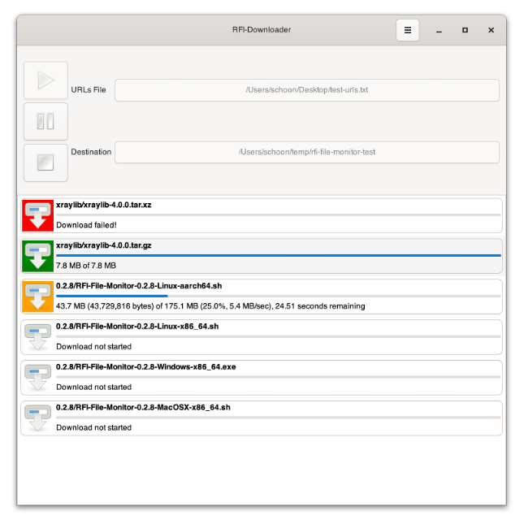

# RFI-Downloader

  

The **RFI-Downloader** is a simple desktop app that allows you to download URLs listed in a text file to your local machine. It is written in Python, and uses Gtk+4 as widget toolkit, while libsoup is used for the HTTP traffic.

This app is intentionally kept simple and allows one to suspend, resume and stop downloads. Files will be overwritten without asking for confirmation if they already exist locally.

A screenshot follows:

## Downloads

The [Releases](https://github.com/rosalindfranklininstitute/rfi-downloader/releases) section contains installers for Windows, macOS and Linux. These will create an isolated conda environment, and download all dependencies in there. If you do not override the default installation options, there should not be a conflict with your other Python interpreters and/or conda installations.

The package is also [available](https://pypi.org/project/rfi-downloader/) on PyPI, but we do not recommend the package to be installed through `pip`, as it depends on the complex Gtk4 stack, which must be installed using a different mechanism.

## License

The **RFI-Downloader** is licensed under 3-Clause BSD License